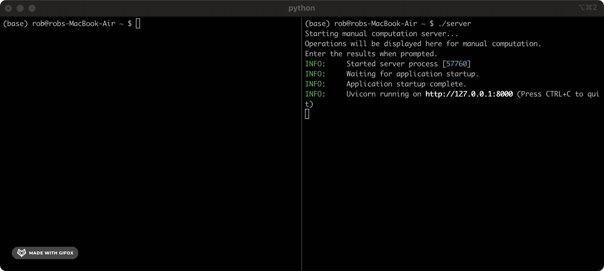

# CUDAAAAGH (Centralized Underage Distributed Arithmetic - Automated Assignment And Group Hashing)

CUDAAAAGH allows you to distribute arithmetic computations across a network of ~~children doing their maths homework~~ Computation Partners by replacing Python's standard integer operations with remote calls to a manual computation server.



This allows you mine Bitcoin or train AI models for free. See [my blog post](https://robertheaton.com/minor-miner) introducing CUDAAAAGH and my new company MinorMiner for more details.


CUDAAAAGH includes:

- A custom integer type (`CUDAAAAGHInt`) that provides standard arithmetic operations
- A manual computation server for processing arithmetic operations
- An implementation of SHA-256 using only basic arithmetic operations
- Support for bitwise operations decomposed into simple arithmetic

## Installation

```bash
pip install CUDAAAAGH
```

## Quick Start

1. Start the computation server:

```python
from CUDAAAAGH import start_server
import asyncio

if __name__ == "__main__":
    asyncio.run(start_server(host="127.0.0.1", port=8000))
```

2. In another terminal, use CUDAAAAGH for computations:

```python
from CUDAAAAGH import CUDAAAAGHInt, set_compute_endpoint

# Configure the endpoint
set_compute_endpoint("http://localhost:8000/compute")

# Basic arithmetic
a = CUDAAAAGHInt(10)
b = CUDAAAAGHInt(5)

# Any computation will be performed remotely by a Computation Partner/child
# doing their maths homework!
#
# This will take a few seconds for a Computation Partner to solve:
result = a + b
print(f"10 + 5 = {result}")

# This will take a few thousand years or so:
hash_result = sha256("Hello!", CUDAAAAGHInt)
print(f"SHA-256 hash: {hash_result}")
```

## Features

* Basic Arithmetic: Addition (`+`), Subtraction (`-`), Multiplication (`*`), Floor Division (`//`)
* Bitwise: AND (`&`), OR (`|`), XOR (`^`), Left Shift (`<<`), Right Shift (`>>`)
* Comparison: Equal to (`==`), Greater than (`>`), Less than (`<`), Greater than or equal to (`>=`), Less than or equal to (`<=`)

### Advanced Features
- SHA-256 implementation using only basic arithmetic
- Parallel computation support using futures
- Automatic operation decomposition

## Development

1. Clone the repository:
```bash
git clone https://github.com/robert/CUDAAAAGH.git
cd CUDAAAAGH
```

2. Install development dependencies:
```bash
pip install -e ".[dev]"
```

3. Run tests:
```bash
pytest
```

## Contributing

Contributing to this project is unlikely to be a good use of your time. But if you insist:

1. Fork the repository
2. Create a feature branch
3. Make your changes
4. Submit a pull request

## Author

Robert Heaton ([blog](https://robertheaton.com), [@robjheaton](https://twitter.com/robjheaton))
